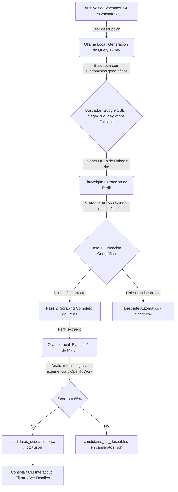

# ReferLooker 🔍💼

ReferLooker es un sistema automatizado y desatendido de reclutamiento y *sourcing* de candidatos de LinkedIn. Está diseñado para funcionar en segundo plano, procesando descripciones de vacantes en formato de texto simple (`.txt`), buscando perfiles activos en LinkedIn (*Open to Work*) mediante técnicas de búsqueda *X-Ray*, y evaluando el nivel de compatibilidad (*match*) de los candidatos utilizando un Modelo de Lenguaje (LLM) local a través de **Ollama** (idealmente optimizado con aceleración por GPU, ej: RTX 5070).

Los candidatos seleccionados se consolidan en reportes de fácil lectura (Excel y Texto Plano), listos para que un reclutador realice el contacto directo en LinkedIn y gestione el referido.

---

## 🏗️ Arquitectura y Funcionamiento

El flujo del sistema se divide en 5 etapas principales que se ejecutan automáticamente:



### Carpetas del Proyecto

*   **`src/`**: Contiene el código fuente modular del sistema.
    *   [`main.py`](file:///d:/Documents/Automations/ReferLooker/src/main.py): Orquestador principal y menú interactivo.
    *   [`cli.py`](file:///d:/Documents/Automations/ReferLooker/src/cli.py): CLI interactivo para visualizar, buscar y filtrar candidatos.
    *   [`linkedin_scraper.py`](file:///d:/Documents/Automations/ReferLooker/src/linkedin_scraper.py): Extractor de perfiles con Playwright y autorecuperación.
    *   [`evaluator.py`](file:///d:/Documents/Automations/ReferLooker/src/evaluator.py): Lógica de evaluación de candidatos con Ollama.
    *   [`query_generator.py`](file:///d:/Documents/Automations/ReferLooker/src/query_generator.py): Creación y auto-refinamiento de búsquedas X-Ray.
    *   [`search_engine.py`](file:///d:/Documents/Automations/ReferLooker/src/search_engine.py): Conectores de búsqueda (Google API, SerpAPI, Playwright).
    *   [`save_cookies.py`](file:///d:/Documents/Automations/ReferLooker/src/save_cookies.py): Utilidad para guardar la sesión iniciada de LinkedIn.
*   **`vacantes/`**: Carpeta de entrada. Coloca aquí archivos `.txt` con las descripciones de puestos.
*   **`procesadas/vacantes_viejas/`**: Histórico. Aquí se mueven las vacantes cuando decides archivarlas.
*   **`output/`**: Carpeta de salida con los reportes consolidados:
    *   `candidatos_deseables.xlsx`: Reporte principal estructurado y ordenado por score.
    *   `candidatos_deseables.txt`: Reporte consolidado en texto plano.
    *   `candidatos.json`: Base de datos local en JSON con todos los detalles de los candidatos procesados (deseables y no deseables).
    *   `processed_urls.json`: Registro de enlaces ya procesados para evitar duplicar scraping y llamadas de API.
    *   `referral_bot.log`: Log consolidado de la ejecución del sistema.

---

## 🛠️ Requisitos Previos

Antes de ejecutar ReferLooker, asegúrate de contar con lo siguiente instalado en tu sistema:

1.  **Python 3.10 o superior**
2.  **Ollama** instalado y corriendo localmente ([Descargar Ollama](https://ollama.com/)).
    *   Descarga el modelo recomendado (por defecto `llama3.1:8b` o puedes configurar otro como `qwen2.5:14b` si cuentas con una GPU dedicada potente como la RTX 5070):
        ```bash
        ollama pull llama3.1:8b
        ```
3.  **Google Chrome** o Chromium (Playwright instalará los binarios necesarios).

---

## 🚀 Guía de Instalación y Configuración

Sigue estos pasos detallados para poner en marcha el sistema:

### Paso 1: Clonar e Instalar Dependencias

Abre tu terminal en la carpeta del proyecto e instala las librerías necesarias:

```powershell
# Instalar dependencias de Python
pip install -r requirements.txt

# Instalar navegadores para Playwright
playwright install chromium
```

### Paso 2: Configurar Variables de Entorno

1.  Copia el archivo `.env.template` y renombralo a `.env`:
    ```powershell
    copy .env.template .env
    ```
2.  Abre el archivo `.env` y configura tus credenciales de búsqueda. Tienes dos opciones de proveedores de búsqueda:
    *   **Opción A (Google Custom Search API - Recomendado)**:
        *   Obtén una API Key de Google Developer Console.
        *   Crea un buscador personalizado (CSE) en Google Programmable Search Engine y obtén el identificador `CX` (configúralo para buscar en todo el web, pero limitando los dorks).
        *   Coloca `GOOGLE_API_KEY` y `GOOGLE_CX`.
    *   **Opción B (SerpAPI)**:
        *   Regístrate en SerpAPI y copia tu clave.
        *   Coloca `SERPAPI_KEY` en el archivo `.env`.

> [!NOTE]
> Si no cuentas con ninguna API de búsqueda configurada, ReferLooker activará un **mecanismo de contingencia automático** que realiza búsquedas directas en Google utilizando Playwright en modo visible. Si aparece un CAPTCHA, el sistema pausará la ejecución y te pedirá resolverlo manualmente para continuar.

### Paso 3: Configurar Parámetros del Sistema (`config.json`)

Edita el archivo `config.json` para ajustar parámetros a tus necesidades:
*   `ollama.model`: Nombre del modelo a utilizar en Ollama (ej: `llama3.1:8b`).
*   `ollama.host`: URL de la API de Ollama (por defecto `http://localhost:11434`).
*   `search_limits.max_results_per_vacancy`: Cantidad máxima de perfiles a buscar y procesar por cada intento.
*   `evaluation.min_score`: Puntuación mínima para clasificar a un candidato en Excel (por defecto 80 u 85 según tus reportes).
*   `scraping.headless`: Determina si el navegador de Playwright se ejecuta en segundo plano (`true`) o de forma visible (`false`). Se recomienda `true` para scraping desatendido y `false` para depurar problemas.

### Paso 4: Iniciar Sesión en LinkedIn (Guardar Cookies)

Para evitar que LinkedIn bloquee la extracción o solicite inicio de sesión constante, ReferLooker utiliza un perfil persistente y guarda tu estado de sesión.

1.  Ejecuta el script de inicio de sesión:
    ```powershell
    python src/save_cookies.py
    ```
2.  Se abrirá una ventana de Chromium de manera visible. **Inicia sesión en tu cuenta de LinkedIn** manualmente.
3.  Resuelve cualquier verificación de seguridad o MFA que solicite LinkedIn.
4.  Una vez te encuentres en la página de inicio (*feed*) de LinkedIn, regresa a la terminal y presiona **ENTER**.
5.  El script guardará las cookies de autenticación en `cookies.json` e inicializará el directorio `linkedin_profile_context`. Ya puedes cerrar el navegador.

---

## 📖 Manual de Operación

Una vez configurado todo, puedes iniciar el programa principal:

```powershell
python src/main.py
```

Se desplegará el **Menú Principal** interactivo en la terminal:

```text
============================================================
                 REFERLOOKER - MENÚ PRINCIPAL
============================================================
1. Procesar vacantes abiertas (carpeta 'vacantes/')
2. Reanudar búsqueda de vacantes procesadas (carpeta 'procesadas/vacantes_viejas/')
3. Navegar y filtrar candidatos (CLI interactivo)
q. Salir
============================================================
```

### Opción 1: Procesar vacantes abiertas
1.  Coloca uno o más archivos `.txt` en la carpeta `vacantes/` (por ejemplo: `vacantes/devops_engineer.txt`). El contenido debe ser la descripción del perfil buscado.
2.  Selecciona la opción `1`.
3.  El sistema:
    *   Analizará la vacante con Ollama y extraerá el rol y el país de destino.
    *   Generará un Dork de búsqueda X-Ray optimizado (ej: `site:mx.linkedin.com/in/ "open to work" ("DevOps" OR "SRE")`).
    *   Buscará perfiles utilizando la API (o el fallback visible en caso de fallar).
    *   Visitará cada perfil en LinkedIn utilizando tu sesión.
    *   **Filtro Geográfico Inmediato**: Evaluará el país del candidato. Si no coincide con el país solicitado en la vacante, lo descarta inmediatamente asignándole `Score: 0%` para ahorrar recursos y tiempo.
    *   **Evaluación Completa**: Si el país coincide, extraerá su extracto, experiencia y habilidades, y le pedirá a Ollama una evaluación detallada de match, score y un resumen en español.
    *   **Resultados**: Si el score de match es **>= 85%**, lo agregará a tus reportes (`output/candidatos_deseables.xlsx` y `.txt`) y lo registrará en `output/candidatos.json`.
4.  Al final de procesar la búsqueda de una vacante, el programa listará en la terminal los candidatos encontrados y te preguntará:
    `¿Estás satisfecho con los resultados obtenidos para la vacante '[nombre]'? (S/N) [S]:`
    *   **Si respondes Sí (S)**: El archivo `.txt` de la vacante se moverá automáticamente a `procesadas/vacantes_viejas/` para mantener limpia tu carpeta de trabajo.
    *   **Si respondes No (N)**: El sistema consultará a Ollama para **auto-refinar la consulta de búsqueda** con términos alternativos y ejecutar una nueva búsqueda (paginada automáticamente para evitar repetir perfiles).

### Opción 2: Reanudar búsqueda de vacantes procesadas
Si tienes vacantes que ya habías archivado en `procesadas/vacantes_viejas/` pero quieres buscar más candidatos para ellas:
1.  Selecciona la opción `2`.
2.  Verás una lista numerada de las vacantes archivadas históricamente.
3.  Selecciona el número correspondiente para iniciar una nueva tanda de búsqueda. El paginado de Google compensará automáticamente los candidatos que ya procesaste previamente basándose en tu historial para traerte nuevos prospectos.

### Opción 3: Navegar y filtrar candidatos (CLI interactivo)
Abre un visualizador interactivo avanzado de los candidatos evaluados hasta la fecha:
```text
+-----+---------------------------+-------+------------+---------------------------------+
|  #  |          Nombre           | Score | OpenToWork |            Ubicación            |
+-----+---------------------------+-------+------------+---------------------------------+
|  1  | Juan Perez | Python Devr  |   94% |     Sí     | México                          |
|  2  | Maria Gomez | Cloud Engr  |   88% |     No     | Monterrey, Nuevo León, México   |
+-----+---------------------------+-------+------------+---------------------------------+
```
Desde este CLI puedes:
*   Visualizar candidatos ordenados por score.
*   **Filtrar** por vacante, score mínimo, disponibilidad de *OpenToWork*, o palabras clave en su perfil.
*   Seleccionar un número para ver el **perfil completo y la evaluación detallada** generada por la IA (incluyendo sus brechas y fortalezas detectadas).
*   **Exportar** la vista filtrada actual a un reporte CSV personalizado.

---

## 🔍 Detalles Técnicos Importantes

### Autorecuperación del Scraper (Self-Healing)
El scraper de LinkedIn ([`linkedin_scraper.py`](file:///d:/Documents/Automations/ReferLooker/src/linkedin_scraper.py)) cuenta con técnicas de auto-recuperación:
*   **Scroll dinámico (Lazy load)**: Desplaza la página de LinkedIn de forma controlada para gatillar la carga perezosa de los elementos del perfil (como experiencia y educación).
*   **Expansión de botones colapsados**: Busca selectores específicos de botones como *"ver más"* o *"show more"* y hace clic en ellos para obtener descripciones completas.
*   **Navegación recursiva a subpáginas**: Si los selectores rápidos fallan en la página principal del perfil (layout en blanco o restringido), Playwright navegará de forma dirigida a subsecciones específicas de LinkedIn (ej: `linkedin.com/in/usuario/details/experience/` y `skills/`) para forzar la extracción limpia de los textos.

### Sesión de LinkedIn y Seguridad
*   El script principal verifica la sesión al iniciar. Si LinkedIn solicita loguearse de nuevo o expira tu sesión, el navegador se abrirá temporalmente en modo visible (`headless=False`) permitiéndote interactuar para renovar el acceso. Una vez completado, el programa reanudará automáticamente el scraping desatendido.
*   Para proteger tu cuenta de LinkedIn, el sistema incluye pausas aleatorias de navegación y simulación de comportamiento humano.

---

## 🪵 Diagnóstico y Logs

Toda la salida de la terminal y los errores detectados por el sistema se duplican automáticamente en el archivo [`output/referral_bot.log`](file:///d:/Documents/Automations/ReferLooker/output/referral_bot.log) gracias a la clase `Tee`. Si experimentas un comportamiento inesperado, revisa este archivo para analizar la traza de ejecución detallada.
