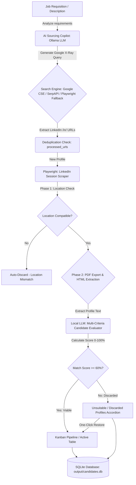

# ReferLooker 🔍💼
### AI-Powered Candidate Sourcing & Modern Web ATS Platform (v2.0.0)

ReferLooker is an automated, unattended recruitment and candidate sourcing platform for LinkedIn. It streamlines talent acquisition by combining **Google X-Ray Boolean search techniques**, **Playwright session-based profile extraction**, and **Local Large Language Model (LLM) screening via Ollama** (with GPU acceleration on local hardware) — all unified within a modern, responsive Glassmorphism Web ATS and interactive Kanban pipeline.

---

## 🌟 Key Highlights & Core Capabilities

*   🎯 **Job Requisitions Hub**: Manage multiple concurrent job requisitions with priority starring, status tracking (Active / Archived), and real-time metric counters.
*   🤖 **AI Sourcing Copilot Studio**: Conversational LLM assistant that analyzes Job Descriptions (JDs) and generates precision Google X-Ray queries with Boolean operators (`site:linkedin.com/in/`), seniority filtering, and geographic targeting.
*   ⚖️ **Multi-Dimensional AI Evaluation Engine**:
    *   **Scoring Breakdown**: Technical Stack (40%), Relevant Experience (40%), and Auxiliary Tools / Cloud (20%).
    *   **Open to Work (OTW) Badging**: Identifies actively looking talent without penalizing passive top candidates.
    *   **Automated Summaries**: Actionable bullet points highlighting strengths, match rationale, and potential gaps.
*   📊 **Strict Partitioning Pipeline & Kanban Board**:
    *   **Active Kanban Board & Table**: Strictly displays viable candidates ($\ge 60\%$ score, compatible location, active status).
    *   **Unsuitable / Discarded Profiles Accordion**: Houses filtered profiles ($<60\%$, location mismatch, or manually discarded) in a collapsible, scrollable sub-table.
    *   **Zero Duplication Guarantee**: Mathematically disjoint sets — candidates reside in strictly one view.
    *   **Single-Click Restoration**: `Move to Pipeline` instantly reclassifies and promotes a discarded candidate into the active board.
*   💡 **AI Discard Trend Insights**: Proactively detects patterns across discarded profiles (e.g. *96% geographic mismatch* or *missing core framework*) and provides one-click Copilot query suggestions to calibrate sourcing.
*   🔄 **Batch Re-evaluation Engine**: Re-score existing candidate pools when requirements change with live progress spinners and toast notifications.
*   💬 **Personalized Outreach Generator**: Instantly drafts tailored LinkedIn connection messages citing candidate experience and role highlights.
*   📥 **Manual Candidate Ingestion**: Add external referrals or pasted resumes for immediate AI parsing, evaluation, and pipeline placement.
*   🗄️ **Transactional SQLite Storage**: Complete local persistence in `output/candidates.db` with automated migrations and URL deduplication.

---

## 🏗️ Architecture & Sourcing Workflow



---

## 📁 Repository Structure

```text
ReferLooker/
├── src/
│   ├── dashboard.py          # Flask Web ATS backend & REST API endpoints
│   ├── database.py           # SQLite database schema, CRUD queries, & migrations
│   ├── evaluator.py          # LLM evaluation engine & outreach message generator
│   ├── query_generator.py    # AI Copilot studio & Boolean X-Ray query generator
│   ├── linkedin_scraper.py   # Playwright scraper (PDF export & HTML fallback)
│   ├── search_engine.py      # Google CSE, SerpAPI, and Playwright search backends
│   ├── main.py               # CLI menu orchestrator
│   ├── cli.py                # Interactive terminal candidate browser
│   ├── save_cookies.py       # LinkedIn session recorder & cookie persister
│   └── templates/
│       └── index.html        # Modern Glassmorphism Web ATS Single Page Application
├── tests/                    # Unit and integration test suite
│   ├── test_copilot.py
│   ├── test_manual_candidate.py
│   └── test_live_sourcing_flow.py
├── vacancies/                # Input folder for plain text Job Descriptions (.txt)
├── processed/                # Archived vacancy descriptions
├── output/                   # SQLite database (candidates.db), logs, and PDFs
├── config.json               # System configuration (LLM models, limits, scraping)
├── requirements.txt          # Python dependencies
└── README.md                 # Project documentation
```

---

## 🛠️ Prerequisites

1.  **Python 3.10+** (Python 3.11 recommended).
2.  **Ollama** installed and running locally ([https://ollama.com](https://ollama.com)).
    *   Pull the default model (e.g. `llama3.1:8b` or `qwen2.5:14b`):
        ```powershell
        ollama pull llama3.1:8b
        ```
3.  **Chromium Browser** (installed automatically via Playwright).

---

## 🚀 Installation & Setup

### 1. Install Dependencies
```powershell
# Install required Python packages
pip install -r requirements.txt

# Install Playwright browser contexts
playwright install chromium
```

### 2. Environment Configuration (`.env`)
Create a `.env` file in the root directory (copy from `.env.template`):
```powershell
copy .env.template .env
```

Configure your search credentials in `.env`:
*   **Google Custom Search API (Recommended)**:
    ```env
    GOOGLE_API_KEY="your_google_api_key"
    GOOGLE_CX="your_custom_search_cx"
    ```
*   **SerpAPI (Alternative)**:
    ```env
    SERPAPI_KEY="your_serpapi_key"
    ```
> [!NOTE]
> If API keys are omitted, ReferLooker defaults to a resilient **Playwright headful search fallback** that opens Google Search in a browser and pauses if a CAPTCHA appears.

### 3. Application Settings (`config.json`)
```json
{
  "ollama": {
    "host": "http://localhost:11434",
    "model": "llama3.1:8b"
  },
  "search_limits": {
    "max_results_per_vacancy": 10
  },
  "evaluation": {
    "min_score": 60
  },
  "scraping": {
    "headless": true
  }
}
```

### 4. Authenticate with LinkedIn (Session Cookies)
To access profile details, save your authenticated LinkedIn session:
```powershell
python src/save_cookies.py
```
1. A Chromium browser window will open. Log into your LinkedIn account.
2. Complete any MFA or security verification.
3. Once on your LinkedIn feed, return to the terminal and press **ENTER**.
4. Cookies are persisted to `cookies.json` and `linkedin_profile_context`.

---

## 💻 Running ReferLooker

### Option A: Modern Web ATS & Dashboard (Recommended)
Start the web platform:
```powershell
python src/dashboard.py
```
Open your browser and navigate to:
```text
http://127.0.0.1:5000
```

#### Web ATS Capabilities:
1. **Requisitions Hub**: Create, edit, star, archive, or delete job requisitions.
2. **AI Copilot Modal**: Click **"Run AI Sourcing"** on any job to interact with the LLM, refine the Boolean search string, and launch automated searches.
3. **Interactive Kanban Pipeline**: Drag or switch candidate stages across *To Contact*, *Contacted*, *In Discussion*, and *Hired*.
4. **Discarded Accordion**: Expand the *Unsuitable / Discarded Profiles* section at the bottom to audit non-qualifying profiles or click **"Move to Pipeline"** to rescue candidates.
5. **AI Discard Trends**: View proactive insight chips alerting to location mismatches or skill trends.
6. **Outreach & Modal Details**: Click **"Message"** on any candidate card to generate a personalized outreach message and copy it with one click.
7. **Manual Candidate Addition**: Click **"+ Add Candidate"** to paste a resume or LinkedIn profile URL for instant scoring.

---

### Option B: Interactive Terminal CLI
For terminal-first workflows:
```powershell
python src/main.py
```

*   **Option 1**: Process text files in `vacancies/`.
*   **Option 2**: Resume searches for archived requisitions.
*   **Option 3**: Interactive console browser with tabular views, keyword filtering, and CSV export.

---

## 🧪 Testing & Validation

Execute the automated test suite:
```powershell
python -m unittest discover tests
```

---

## 📋 Changelog (v2.0.0)

*   **Strict Pipeline Partitioning**: Resolved all candidate duplication by enforcing mutually disjoint queries between the Kanban board ($\ge 60\%$) and Discarded Accordion ($<60\%$).
*   **Single-Click Candidate Restoration**: Added `/api/candidates/<id>/restore` endpoint to immediately promote discarded profiles to the active pipeline.
*   **AI Discard Trend Insights**: Integrated statistical pattern detection for geographical and technical discard clusters.
*   **Interactive Sourcing Copilot**: Added interactive chat modal with dynamic Boolean query generator and preset refinement chips.
*   **Open to Work Informative Badging**: Updated evaluation criteria to reward Open to Work profiles with a visual badge without disqualifying passive talent.
*   **Job Requisitions Hub**: Implemented priority starring, direct CRUD management, and live metric aggregation.

---

## 📄 License
Internal Automation & Recruitment Tool. All rights reserved.
