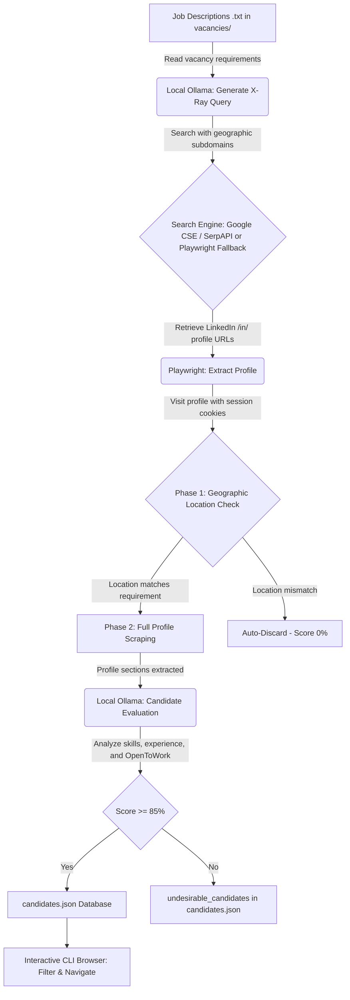

# ReferLooker 🔍💼

ReferLooker is an automated, unattended recruitment and candidate sourcing system for LinkedIn. It works in the background by processing vacancy descriptions in plain text (`.txt`), searching for active LinkedIn candidates (*Open to Work*) using Google *X-Ray* search techniques, and evaluating candidate profiles against job requirements using a local Large Language Model (LLM) via **Ollama** (leveraging local GPU acceleration, e.g., RTX 5070, for fast inference).

Candidates are processed and stored directly in a structured JSON database, ready to be navigated and filtered using the interactive Candidate Browser CLI. This allows recruiters to immediately review candidates, connect with them on LinkedIn, and submit them to their company's referral program.

---

## 🏗️ Architecture & Sourcing Workflow

The system executes in a modular, 5-stage automated pipeline:



### Folder Structure

*   **`src/`**: Contains the system's modular source code.
    *   [`main.py`](file:///d:/Documents/Automations/ReferLooker/src/main.py): Main orchestrator and CLI menu interface.
    *   [`cli.py`](file:///d:/Documents/Automations/ReferLooker/src/cli.py): Interactive console CLI browser for candidate records, advanced filters, and exports.
    *   [`linkedin_scraper.py`](file:///d:/Documents/Automations/ReferLooker/src/linkedin_scraper.py): Playwright-based scraper for extracting public profile details.
    *   [`evaluator.py`](file:///d:/Documents/Automations/ReferLooker/src/evaluator.py): LLM evaluator client connecting to Ollama.
    *   [`query_generator.py`](file:///d:/Documents/Automations/ReferLooker/src/query_generator.py): Extracts requirements and compiles/refines Google X-Ray search query strings.
    *   [`search_engine.py`](file:///d:/Documents/Automations/ReferLooker/src/search_engine.py): Executes searches via Google Custom Search Engine, SerpAPI, or direct Playwright.
    *   [`save_cookies.py`](file:///d:/Documents/Automations/ReferLooker/src/save_cookies.py): Utility script to capture and persist LinkedIn session cookies.
*   **`vacancies/`**: Input folder. Place job description `.txt` files here.
*   **`processed/archived_vacancies/`**: History directory. Vacancy files are moved here once fully processed.
*   **`output/`**: Output directory containing candidate database and logs:
    *   `candidates.json`: Structured database containing details of all candidates evaluated (desirable and undesirable). This is the single source of truth for all candidate records.
    *   `processed_urls.json`: History log of scraped profile URLs to avoid double-processing and API waste.
    *   `referral_bot.log`: Log file mapping all system terminal events.

---

## 🛠️ Prerequisites

To run ReferLooker, ensure your system has:

1.  **Python 3.10 or higher**
2.  **Ollama** installed and running locally ([Download Ollama](https://ollama.com/)).
    *   Pull the recommended model (defaults to `llama3.1:8b`, but you can customize it in configurations to models like `qwen2.5:14b` if running on a powerful local GPU like the RTX 5070):
        ```bash
        ollama pull llama3.1:8b
        ```
3.  **Google Chrome** or Chromium (Playwright will download required binaries during installation).

---

## 🚀 Installation & Configuration

### Step 1: Install Dependencies

Open a terminal in the project root directory and run:

```powershell
# Install python requirements
pip install -r requirements.txt

# Install Playwright browser contexts
playwright install chromium
```

### Step 2: Configure Environment Variables

1.  Copy the template file `.env.template` and rename it to `.env`:
    ```powershell
    copy .env.template .env
    ```
2.  Open `.env` and fill in your keys. The search engine supports two API providers:
    *   **Option A (Google Custom Search API - Recommended)**:
        *   Obtain a Custom Search API Key from the Google Developer Console.
        *   Create a programmable search engine (CSE) at Google Programmable Search, get the `CX` identifier, and set it to search the web with custom dorks.
        *   Fill in `GOOGLE_API_KEY` and `GOOGLE_CX`.
    *   **Option B (SerpAPI)**:
        *   Register at SerpAPI, retrieve your private API key, and set `SERPAPI_KEY`.

> [!NOTE]
> If no search keys are configured, ReferLooker automatically defaults to a **resilient Playwright fallback search**. It will open Google Search in a headful browser. If a CAPTCHA appears, it pauses the script and waits for you to solve it manually before proceeding.

### Step 3: Configure Settings (`config.json`)

Adjust the project settings in `config.json`:
*   `ollama.model`: The LLM model name loaded in Ollama (default: `llama3.1:8b`).
*   `ollama.host`: Connection URL to Ollama (default: `http://localhost:11434`).
*   `search_limits.max_results_per_vacancy`: Maximum profiles to scrape and evaluate per run.
*   `evaluation.min_score`: Minimum compatibility score required to include a candidate in Excel reports (default: 80).
*   `scraping.headless`: Set to `true` to run Playwright invisibly in the background. Set to `false` for debugging scraper steps.

### Step 4: Login to LinkedIn (Save Session Cookies)

To bypass LinkedIn sign-in walls, the scraper uses a persistent browser profile.

1.  Execute the session recorder:
    ```powershell
    python src/save_cookies.py
    ```
2.  A Chromium browser will open. **Log in manually to your LinkedIn account**.
3.  Resolve any verification checks (MFA or CAPTCHAs) if prompted.
4.  Once you reach your LinkedIn home feed, go back to the terminal and press **ENTER**.
5.  The script will save the authorization state in `cookies.json` and initialize `linkedin_profile_context`. You can then close the browser window.

---

## 📖 Operation Manual

Start the main orchestrator program:

```powershell
python src/main.py
```

This starts the interactive **Main Menu** in your terminal:

```text
============================================================
                 REFERLOOKER - MAIN MENU
============================================================
1. Process open vacancies (folder 'vacancies/')
2. Resume search for processed vacancies (folder 'processed/archived_vacancies/')
3. Browse and filter candidates (interactive CLI)
q. Quit
============================================================
```

### Option 1: Process open vacancies
1.  Drop vacancy descriptions as `.txt` files in the `vacancies/` folder (e.g., `vacancies/devops.txt`).
2.  Select option `1`.
3.  The pipeline will:
    *   Analyze the vacancy with Ollama to extract the role and work country requirement.
    *   Generate a targeted Google X-Ray search query (e.g., `site:mx.linkedin.com/in/ "open to work" ("DevOps" OR "SRE")`).
    *   Find candidates using the search APIs (or headful Playwright fallback).
    *   Scrape each profile using Playwright and your cookies.
    *   **Immediate Location Filter**: Check the candidate's country. If it does not match the vacancy requirements, the candidate is discarded immediately (`Score: 0%`) to save resources.
    *   **LLM Screening**: If location matches, extract About, Experience, and Skills, and ask Ollama to generate a detailed match score, OpenToWork verification, and strengths/gaps summary in English.
    *   **Database Storage**: All candidates are saved directly into the JSON candidate database: `output/candidates.json`.
4.  Once a vacancy run finishes, the script lists candidates and prompts:
    `Are you satisfied with the results obtained for vacancy '[title]'? (Y/N) [Y]:`
    *   **Yes (Y)**: Moves the vacancy description file to `processed/archived_vacancies/` to archive it.
    *   **No (N)**: Directs Ollama to **auto-refine the search query** with alternative terms and runs another search iteration (using automated pagination offsets to avoid duplicate profiles).

### Option 2: Resume search for processed vacancies
If you have previously archived vacancy descriptions in `processed/archived_vacancies/` but want to search for more candidates:
1.  Select option `2`.
2.  You will see a list of archived vacancies.
3.  Select the corresponding index. The search query will run with a pagination offset matching the number of candidates already processed for that vacancy, finding new candidates.

### Option 3: Browse and filter candidates (Interactive CLI Browser)
Launches the console browser to explore candidate profiles:
```text
+-----+---------------------------+-------+------------+---------------------------------+
|  #  |           Name            | Score | OpenToWork |            Location             |
+-----+---------------------------+-------+------------+---------------------------------+
|  1  | John Doe | Python Dev     |   94% |    Yes     | Mexico                          |
|  2  | Mary Smith | Cloud Eng    |   88% |     No     | Monterrey, NL, Mexico           |
+-----+---------------------------+-------+------------+---------------------------------+
```
Inside this interactive CLI, you can:
*   Browse all processed candidates.
*   **Filter** by vacancy, minimum score, Open to Work status, or keywords.
*   Select a candidate's number to view their **full profile details, strengths, and LLM evaluation summary**.
*   **Export** your filtered search results directly into a custom CSV spreadsheet report.

---

## 🔍 Technical Details

### Scraper Self-Healing Mechanisms
The LinkedIn profile scraper ([`linkedin_scraper.py`](file:///d:/Documents/Automations/ReferLooker/src/linkedin_scraper.py)) implements automated error recovery to handle dynamic UI changes:
*   **Lazy Loading Scroll Loop**: Progressively scrolls down per profile visit to trigger LinkedIn's asynchronous loading of experience and skills sections.
*   **Button Expansion**: Automatically finds and clicks "see more" and "show more" buttons to retrieve hidden texts.
*   **Direct Subpage Extraction**: If a profile renders sections as empty (due to LinkedIn layout overrides), Playwright will bypass the main page and navigate directly to the specific detail subpages (e.g., `linkedin.com/in/username/details/experience/` and `skills/`) to force a clean text extraction.

### Session Security & Protection
*   The script verifies session status on startup. If LinkedIn requests verification, the script opens a headful window allowing you to log in.
*   The system uses human-like delays and browser parameters to protect your account.

---

## 🪵 Diagnosis and Logs

Terminal outputs and error traces are written to [`output/referral_bot.log`](file:///d:/Documents/Automations/ReferLooker/output/referral_bot.log) via the `Tee` logger. If you notice unexpected behavior, check the log file for details.
